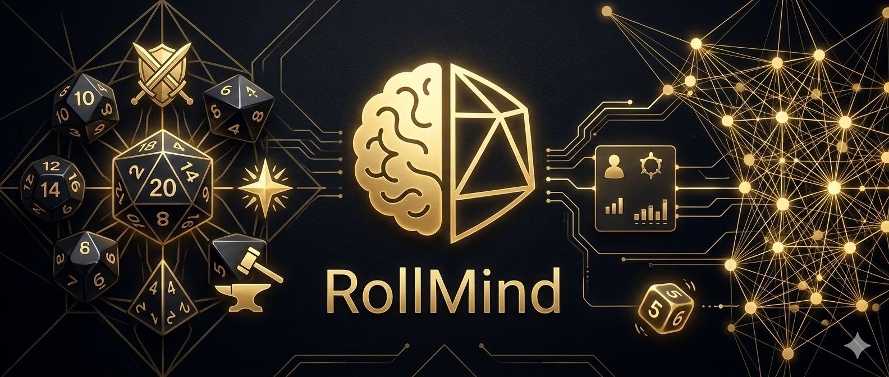

# 🔮 RollMind: The Ultimate D&D 2024 AI Companion

RollMind isn't just another chatbot. It is a specialized, domain-expert Large Language Model (Gemma) fine-tuned specifically on the **2024 D&D Player's Handbook**. 

While generic models often hallucinate rules or mix up editions, RollMind is ground-truth aligned with the 2024 mechanics—from **Weapon Masteries** and **Heroic Inspiration** to the new **Crafting** and **Exhaustion** rules.

---

## ✨ What Makes RollMind Unique?

### 🛡️ Character-Aware Reasoning
RollMind doesn't give generic advice. When you "consult the mind," the system injects your **Character Profile** (Class, Level, Stats) into every prompt. 
*   **Contextual DCs:** Ask "Can I grapple this orc?" and RollMind checks your Strength (Athletics) bonus against the target.
*   **Automatic Math:** Cast *Fireball* and it automatically knows your Spell Save DC and the correct upcasting dice for your slot level.

### 🎲 Functional Dice Rolls (`[ROLL]`)
Generic LLMs are notorious for "hallucinating" dice results (usually 20s or 1s). RollMind uses a custom **Functional Tag System**:
1.  The model identifies a rule requiring a roll.
2.  It outputs a tag: `[ROLL]8d6[/ROLL]`.
3.  The **Web Application** intercepts this tag, performs a **true cryptographic roll**, and streams the result back to you in a beautiful animation.
*See [INFERENCE_FLOW.md](./INFERENCE_FLOW.md) for the full technical breakdown.*

### 📚 Dual-Step Mastery
We don't just "chat" with the model. We train it in two distinct phases:
1.  **Domain Adaptation (Step 1):** Continued pre-training on 100% of the PHB text to ensure absolute rule coverage.
2.  **Instruction Alignment (Step 2):** Fine-tuning on thousands of synthetic Q&A pairs and combat scenarios generated via Vertex AI.

---

## 🤗 Hugging Face Models

Pre-trained adapters and merged models for RollMind are available on the Hugging Face Hub. These models are ready for inference or further fine-tuning.

*   **[RollMind-v1-gemma3-12b](https://huggingface.co/<your-username>/RollMind-v1-gemma3-12b)**: The flagship version based on Gemma 3, offering the best reasoning and rule accuracy.
*   **[RollMind-v1-gemma1.1-7b](https://huggingface.co/<your-username>/RollMind-v1-gemma1.1-7b)**: A high-performance, smaller model ideal for edge deployment or limited VRAM environments.

---

## 🛠️ The Pipeline

### 1. Data Engineering (`prepare/`)
*   **Semantic Chunking:** `prepare_step1_data.py` processes raw markdown into rule-preserving chunks with header context.
*   **Synthetic Generation:** 
    *   `generate_qa.py`: Creates high-fidelity QA pairs from PHB chunks using Vertex AI.
    *   `generate_rolls.py`: Specifically generates `[ROLL]` tag examples from spell documentation.
    *   `generate_scenarios.py`: Simulates complex table situations (Leveling, Combat Maneuvers).
    *   `generate_roll_refusals.py`: Teaches the model when *not* to roll (e.g., Level Mismatch).
*   **Aggregation:** `aggregate_step2_data.py` uses stratified sampling to create a perfectly balanced multi-task training set.

### 2. Training with LoRA (`train/`)
We use **Low-Rank Adaptation (LoRA)** to efficiently teach the model new tricks without breaking its conversational ability.

*   **Step 1 (Rules):** Continued pre-training on 100% rules corpus. 
    `python3 train/step1/train_step1.py --config train/step1/config_step1_7b_r128.json`
*   **Step 2 (Assistant):** Instruction alignment on the aggregated synthetic dataset.
    `python3 train/step2/train_step2.py --config train/step2/config_step2_7b_roll_test1.json`

### 3. The App (`app/`)
A sleek, "Obsidian & Gold" themed Next.js interface featuring:
*   **Streaming Responses:** Watch the rules unfold in real-time.
*   **Interactive Dice Roller:** Built-in component for handling `[ROLL]` tags with cryptographic randomness.
*   **Character Dashboard:** Real-time profile updates that dynamically impact the AI's calculations.

---

## ☁️ Cloud Deployment (Vertex AI)
RollMind is ready for production. 
*   **Merge:** Use `endpoint/merge_model.py` to fuse your LoRA weights.
*   **Deploy:** Use `endpoint/deploy.py` to push to a Vertex AI L4 GPU for scalable, low-latency API access.